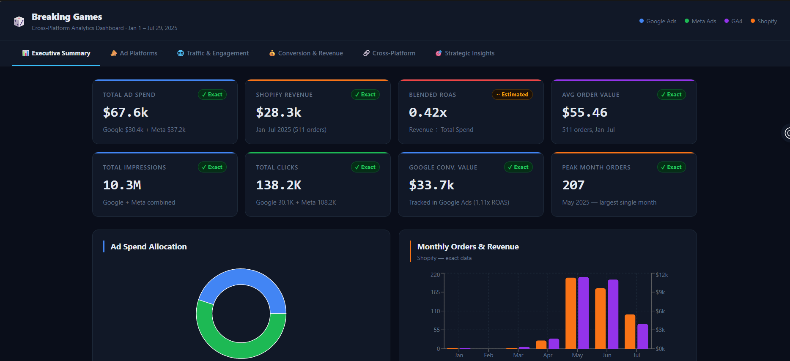
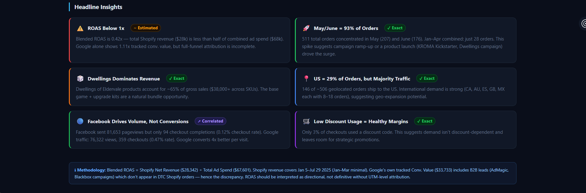

# Fuhaad Ayomide Lawal
### Information Technology Student at NJIT | Data & Business Analytics
[LinkedIn](https://www.linkedin.com/in/fuhaad-lawal-724a73293/) | [Email](fal23@njit.edu) |

---

## 👤 About Me
I bridge the gap between technical data infrastructure and business strategy. I specialize in turning raw, fragmented datasets into interactive business intelligence infrastructure and data-driven insights that optimize organizational revenue and performance.

### 🛠️ Technical Stack
* **Data & Analytics:** SQL, Python (Pandas, NumPy, Seaborn)
* **Business Intelligence:** Power BI, Microsoft Excel
* **Core IT:** Relational Database Design, Systems Analysis, ETL Pipelines

---

## 🚀 Featured Analytics Projects

### 1. DTC E-Commerce Forensic Data Audit & BI Infrastructure
**Role:** Data Analytics & BI Strategy Lead | **Timeline:** May 2026  
**Client:** Breaking Games (Direct-to-Consumer Tabletop Gaming Brand)

#### 📌 Business Problem: The "Spend Paradox"
The client faced a critical financial disconnect: high-level financial logs showed heavy ad spend across Meta and Google Ads, but backend Shopify revenue metrics failed to show an equal return. 
* **The Data Chaos:** Ingested **10 highly fragmented datasets** across e-commerce logs (Shopify), marketing platforms (Meta, Google Ads), and web analytics (GA4) with completely mismatched date/time schemas.
* **The Tracking Black Hole:** Discovered a massive **$91,000 attribution gap** between reported ad spend and recorded backend sales.
* **Security Threat:** Web analytics data was heavily skewed by automated click-spam/bot traffic masquerading as valid human sessions.

  > *The core executive dashboard highlighting critical platform discrepancies (Jan-Jul 2025 data):*
> 

#### 🛠️ Technical Solution: Forensic Engineering & Star Schema Modeling
I engineered an end-to-end data pipeline using **Power BI (Power Query / M Code)** and **DAX** to purify the data and build a unified "Source of Truth" architecture.

#### 📈 Impact & Key Discoveries
* **Plugged the $91,000 Leak:** Proved that missing or broken UTM tracking tags on Google Ads caused hundreds of conversions to pass blindly into Shopify as generic "Direct" traffic, completely blinding the marketing team's ROAS calculations.
* **Isolated the Funnel Leak:** Diagnosed an abrupt **16% cart abandonment drop-off** at the final shipping/payment stage (511 fulfilled orders out of 609 initiated checkouts), isolating technical checkout friction over a lack of product interest.
* **Identified the Hero Product:** Aggregated product performance metrics to mathematically prove that the *Dwellings of Eldervale* product line single-handedly carried the brand's positive revenue curve, while experimental SKU campaigns were draining cash reserves.

 > *Automated traffic filtering results and deep source-level conversion analysis:*
> 

#### 📊 Strategic Executive Deliverables
Delivered an interactive, production-ready **Forensic Power BI Dashboard** to executive stakeholders featuring a multi-axis *Marketing Spend vs. Shopify Revenue Chart*, a *Product Contribution Matrix*, and a *Top Wasted Campaigns Matrix* (which exposed underperforming campaigns like "Search - Blackbox Leads" that spent $6,379 while returning only $132). 

---
